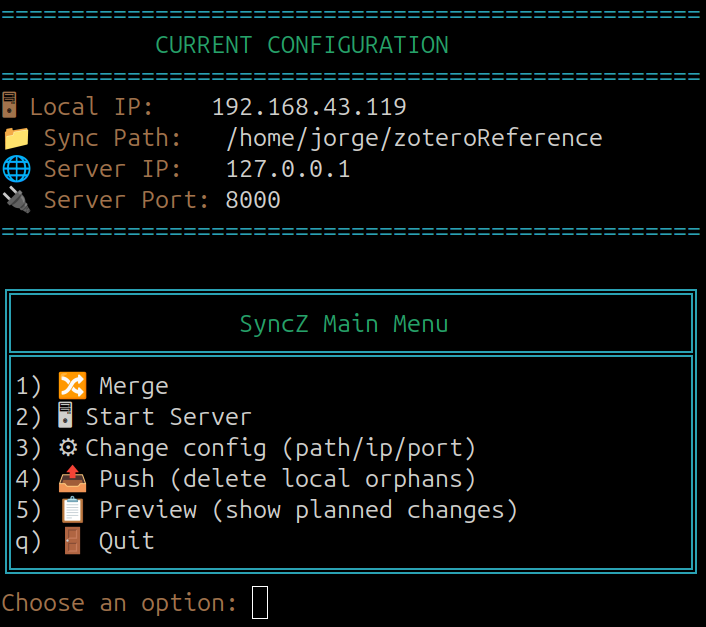
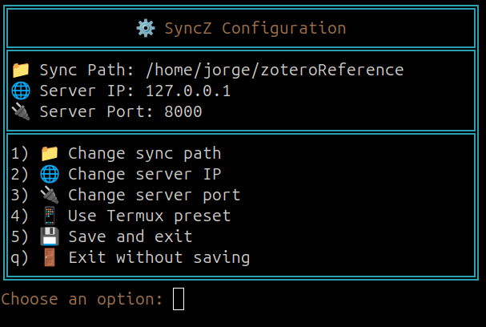
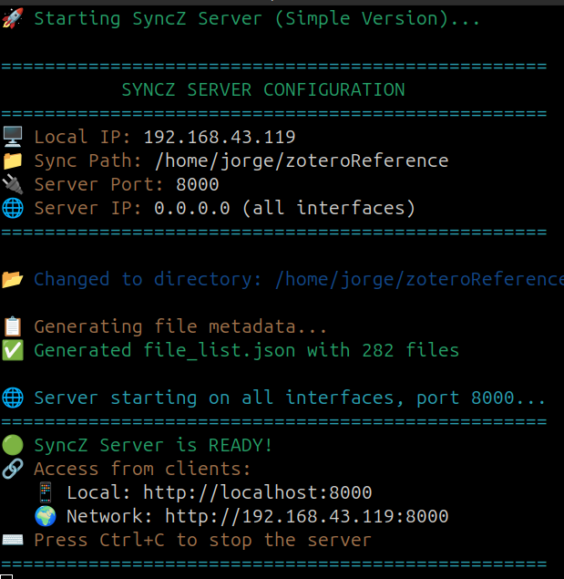

# 🚀 SyncZ - Cross-Device File Synchronization

SyncZ is a modern, user-friendly file synchronization tool designed to keep files synchronized between multiple devices over a local network. With its beautiful colored interface and intelligent features, it's perfect for syncing files between desktop, laptop, and mobile devices using Termux.

## 📸 Screenshots

### 🎮 Main Menu Interface

*Beautiful color-coded main menu with configuration display*

### ⚙️ Configuration Interface  

*Interactive configuration management with real-time validation*

### 🖥️ Server Interface

*Clean server logs with file transfer monitoring*


## ✨ Key Features

- 🎨 **Beautiful Interface**: Colorful, emoji-rich console interface with professional menus and progress bars
- 🔄 **Bidirectional Sync**: Automatically detects and syncs newer files in both directions
- 🧠 **Smart Transfer**: Only transfers files that have changed (based on modification time and SHA256 hash)
- � **Move Detection**: Intelligent file move detection prevents unnecessary downloads
- 📊 **Rich Progress Display**: Real-time upload progress with file counters and human-readable sizes
- �📱 **Mobile-Friendly**: Works seamlessly with Termux on Android devices
- 🛡️ **Safety Features**: PDF deletion confirmation and recycle bin system (10-day auto-cleanup)
- ⚙️ **Easy Configuration**: Interactive configuration management with beautiful box-style displays
- 🌐 **Unified Interface**: Single entry point with multiple operation modes
- 🖥️ **Server Detection**: Graceful handling of server connectivity issues
- 📄 **PDF Search Bar**: Fast PDF launcher with keyboard shortcuts and full path display
- 🎯 **Clean Logging**: Human-readable server logs with file sizes in MB/GB format

## 📄 PDF Search Bar

SyncZ includes a powerful PDF search and launch system that integrates seamlessly with your desktop environment.

### ✨ Features
- **🔍 Fast Search**: Instantly find PDFs by name or path using dmenu
- **📁 Full Path Display**: Shows complete directory structure (e.g., `research/papers/document.pdf`)
- **⌨️ Keyboard Shortcuts**: Quick access via Super+Shift+P (GNOME) or $mod+Shift+P (i3)
- **🎯 Smart Opening**: Opens PDFs with Zathura with optional page jumping
- **📂 Directory Support**: Recursively searches subdirectories
- **🚀 Auto-Installation**: One-command setup for your environment

### 🛠️ Installation

```bash
# Run the unified installer (auto-detects your environment)
./install-pdf-launcher.sh
```

The installer will:
- **Detect your environment** (GNOME/Ubuntu vs i3/Arch)
- **Install dependencies** (dmenu, zathura, fd-find/fd, xdg-utils)
- **Set up keyboard shortcuts** for your desktop environment
- **Configure PDF associations** (sets Zathura as default PDF viewer)

### 🎮 Usage

1. **Keyboard Shortcut**: Press `Super+Shift+P` (GNOME) or `$mod+Shift+P` (i3)
2. **Search Interface**: Type to filter PDFs by name or path
3. **Open PDF**: Press Enter to open with Zathura. To use Okular for annotations, either run `pdf-onebar -x` or type `-x` in the launcher prompt before/after the filename.
4. **Page Jumping**: Append `:12`, `#12`, or `-P 12` to jump to specific pages

> Tip: In the launcher prompt you can type `-x` to open with Okular (requires Okular installed). Append `:12`/`-P 12` to jump straight to a page.

### 📋 Example

```
Your PDF directory structure:
📁 ~/zoteroReference/
├── 📄 important.pdf
├── 📁 research/
│   ├── 📄 paper1.pdf
│   └── 📄 paper2.pdf
└── 📁 books/
    └── 📁 technical/
        └── 📄 manual.pdf

Search bar shows:
- important.pdf
- research/paper1.pdf  
- research/paper2.pdf
- books/technical/manual.pdf
```

### ⚙️ Configuration

The PDF search bar uses your sync directory by default (`~/zoteroReference/`), but you can customize it:

```bash
# Set custom PDF directory
export PDF_DIR_DEFAULT="/path/to/your/pdfs"

# Use different dmenu arguments
export DMENU_ARGS="-i -l 10 -fn 'Ubuntu Mono-12'"
```

## 🎮 How to Use SyncZ

### 🚀 Quick Start

```bash
# Clone the repository
git clone https://github.com/jorgemunozl/syncFilesDevicesLocal.git
cd syncZ

# Run SyncZ (handles setup automatically)
bash syncz_setup.sh

# Optional: Install PDF search bar (requires dmenu + zathura)
./install-pdf-launcher.sh
```

### 💻 Command Options

```bash
# Unified interface with beautiful menu (recommended)
python3 syncz

# Direct server launch with beautiful interface
python3 syncz -s

# Client interface (same as default)
python3 syncz -c
```

### 🎨 The SyncZ Experience

When you launch SyncZ, you'll see:

```
===========================================
          CURRENT CONFIGURATION
===========================================
� Local IP:    192.168.43.119
�📁 Sync Path:   /home/user/zoteroReference
🌐 Server IP:   192.168.1.100
🔌 Server Port: 8000
===========================================

╔══════════════════════════════════════════════╗
║                SyncZ Main Menu               ║
╠══════════════════════════════════════════════╣
║1) � Merge                                   ║
║2) 🖥 Start Server                             ║
║3) ⚙ Change config (path/ip/port)             ║
║4) 📤 Push (delete local orphans)             ║
║5) 📋 Preview (show planned changes)          ║
║q) 🚪 Quit                                    ║
╚══════════════════════════════════════════════╝
```

### ⚙️ Configuration Interface

The new configuration interface features a beautiful box-style layout:

```
╔══════════════════════════════════════════════╗
║             ⚙️  SyncZ Configuration           ║
╠══════════════════════════════════════════════╣
║📁 Sync Path: /home/user/zoteroReference     ║
║🌐 Server IP: 192.168.1.100                  ║
║🔌 Server Port: 8000                         ║
╠══════════════════════════════════════════════╣
║1) 📁 Change sync path                       ║
║2) 🌐 Change server IP                       ║
║3) 🔌 Change server port                     ║
║4) 📱 Use Termux preset                      ║
║5) 💾 Save and exit                          ║
║q) 🚪 Exit without saving                    ║
╚══════════════════════════════════════════════╝
```

## 🏗️ System Architecture

### 🖥️ Server Mode
- **Beautiful startup**: Colorful configuration display and status messages
- **Human-readable logging**: Clean file transfer logs with MB/GB file sizes
- **Smart metadata**: Automatic file list generation with integrity checking
- **Progress tracking**: Real-time upload monitoring with file counters
- **Graceful shutdown**: Professional stop messages

### 💻 Client Mode
- **Server detection**: Automatic connection validation with fallback to menu
- **Move detection**: SHA256-based file move detection to prevent unnecessary transfers
- **Rich progress bars**: Beautiful upload progress with file counts and transfer speeds
- **Smart sync logic**: Intelligent file comparison and transfer decisions
- **Safety confirmations**: PDF deletion requires user confirmation
- **Recycle bin**: Deleted files moved to `deleted/` folder with 10-day auto-cleanup

## 📋 Requirements

- **Python**: 3.6+ 
- **Dependencies**: `requests`, `colorama` (auto-installed)
- **Network**: Local network connectivity between devices

### 📱 For Mobile Devices (Termux)

```bash
# Install Termux from F-Droid (recommended)
# Then run these commands:

pkg update && pkg upgrade
pkg install python git
pip install requests colorama
```

## ⚙️ Configuration

SyncZ uses a `config.json` file that's automatically created and managed through the beautiful interface:

```json
{
  "path": "/home/user/zoteroReference",
  "server_ip": "192.168.1.100", 
  "server_port": 8000
}
```

### 🔧 Easy Configuration Management

1. **Launch SyncZ**: `python3 syncz`
2. **Select option 3**: ⚙️ Change config
3. **Update settings**: Interactive prompts with current values displayed
4. **Automatic saving**: Configuration saved automatically

## 🌐 Network Setup

### 🔍 Find Your Server IP
```bash
# Linux/Mac/Termux
ip addr show | grep inet
# or
hostname -I

# Windows
ipconfig
```

### 📡 Network Requirements
- Both devices on the same WiFi network
- Firewall allows connections on port 8000 (default)
- Server device accessible from client device

## 📱 Termux Integration

### 📲 Installing Termux
- **✅ Recommended**: [F-Droid](https://f-droid.org/packages/com.termux/) 
- **⚠️ Alternative**: [GitHub Releases](https://github.com/termux/termux-app/releases)
- **❌ Avoid**: Google Play Store version (outdated)

### 🔧 Termux Setup
```bash
# Update system
pkg update && pkg upgrade

# Install dependencies  
pkg install python git

# Setup storage access
termux-setup-storage

# Clone SyncZ
git clone https://github.com/jorgemunozl/syncFilesDevicesLocal.git
cd syncZ

# Run SyncZ
python3 syncz
```

### 📂 Storage Access in Termux
```bash
# Your Android storage paths:
~/storage/shared          # Internal storage
~/storage/external-1       # SD card (if available)
~/storage/dcim            # Camera photos
~/storage/downloads       # Downloads folder
```

## 🛡️ Safety Features

### 🗑️ Recycle Bin System
- **Deleted files** moved to `deleted/` folder instead of permanent deletion
- **10-day auto-cleanup** of old files in recycle bin
- **PDF confirmation** required before deletion
- **Timestamp tracking** for deletion date management

### ⚠️ Error Handling
- **Server connectivity** checks with graceful fallback
- **File operation** error handling with clear messages
- **Configuration validation** with helpful error messages
- **Network timeout** handling with retry options

## 🎯 Use Cases

### 📚 Academic & Research
- **Zotero Libraries**: Sync research papers and references
- **BibTeX Files**: Keep `.bib` files synchronized for LaTeX
- **Research Notes**: Sync markdown files and documentation
- **PDF Search**: Use the integrated search bar for instant PDF access

### 💼 Development
- **Code Projects**: Sync between development environments  
- **Configuration Files**: Keep dotfiles and configs in sync
- **Documentation**: Sync project documentation and notes

### 📄 General Use
- **Document Backup**: Important files backed up across devices
- **Media Files**: Photos, music, videos synchronized
- **Mobile Workflows**: Access desktop files on mobile devices

## 🚨 Troubleshooting

### 🔌 Connection Issues
```bash
# Test connectivity
ping <server-ip>

# Check if server is running
curl http://<server-ip>:8000/metadata

# Verify network configuration
ip route | grep default
```

### 📁 Permission Issues
```bash
# Termux storage setup
termux-setup-storage

# Check directory permissions
ls -la <sync-directory>

# Fix permissions if needed
chmod -R 755 <sync-directory>
```

### 🔄 Sync Issues
- **File conflicts**: Newer files take priority (by modification time)
- **Hash mismatches**: Files re-downloaded for integrity
- **Missing files**: Check path configuration and permissions
- **Large files**: Monitor network stability for big transfers

## 🔐 Security Considerations

- **Local Network Only**: Designed for trusted local networks
- **No Authentication**: No built-in user authentication
- **No Encryption**: Data transferred in plain text
- **VPN Recommended**: For remote access scenarios
- **Firewall Rules**: Limit access to trusted devices only

## 🤝 Contributing

We welcome contributions! Here's how to help:

1. **🍴 Fork** the repository
2. **🌿 Create** a feature branch (`git checkout -b feature/amazing-feature`)
3. **💻 Commit** your changes (`git commit -m 'Add amazing feature'`)
4. **📤 Push** to the branch (`git push origin feature/amazing-feature`)
5. **🔀 Open** a Pull Request

## 📄 License

This project is licensed under the MIT License - see the [LICENSE](LICENSE) file for details.

## 🙏 Acknowledgments

- **Colorama**: For beautiful terminal colors
- **Requests**: For reliable HTTP operations  
- **Termux Community**: For mobile Linux environment
- **Python Community**: For the excellent ecosystem

---

## 📞 Support

If you encounter issues or have questions:

1. **📖 Check** this README for solutions
2. **🔍 Search** existing issues on GitHub
3. **🐛 Create** a new issue with detailed information
4. **💬 Join** discussions in the repository

---

*Made with ❤️ for seamless cross-device synchronization*
